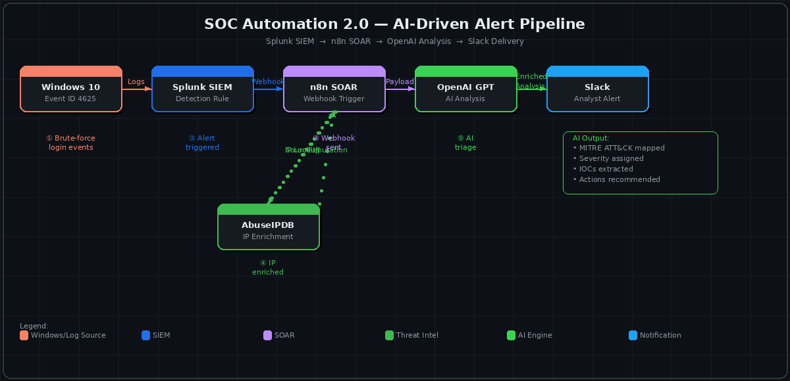

<h1 align="center">🤖 SOC Automation Project 2.0</h1>
<h3 align="center">AI-Driven SOC Alert Pipeline — Splunk · n8n · OpenAI · AbuseIPDB · Slack</h3>

<p align="center">
  
  
  
  
  
  
</p>

---

## 🎯 Project Summary

**SOC Automation 2.0** is an end-to-end AI-powered SOC alert pipeline that takes a raw SIEM detection and automatically delivers a **structured, MITRE ATT&CK-aligned, enriched, analyst-ready alert** to Slack — with zero manual steps.

This project tackles one of the biggest real problems in modern SOC operations: **alert fatigue**. Instead of a Tier-1 analyst manually triaging every alert, this pipeline automates the repetitive work — summarization, IOC enrichment, severity assessment, and MITRE mapping — so analysts can focus on what matters.

> **This is what modern SOC automation actually looks like.**

---

## 🏗️ Architecture



---

## 🔄 The Full Workflow — Step by Step

```
Windows 10 Endpoint
        │
        │  Failed RDP login attempts → Windows Event ID 4625
        ▼
  Splunk Enterprise (SIEM)
        │
        │  Detection rule fires (brute-force pattern)
        │  Webhook action → POST alert payload to n8n
        ▼
  n8n SOAR Workflow
        │
        ├──► AbuseIPDB API
        │         Source IP enrichment
        │         Confidence score, country, abuse categories
        │         └──► Result fed back to n8n
        │
        ├──► OpenAI GPT API
        │         Alert + enrichment context sent as structured prompt
        │         AI returns:
        │           • Plain-English incident summary
        │           • MITRE ATT&CK technique mapping
        │           • Severity rating (Low / Medium / High / Critical)
        │           • Recommended analyst actions
        │           • IOC extraction
        │
        ▼
  Slack (Analyst Channel)
        │
        └──  Structured alert posted:
               ✅ Summary
               ✅ IOCs
               ✅ Threat Intelligence (AbuseIPDB)
               ✅ MITRE ATT&CK mapping
               ✅ Severity
               ✅ Recommended actions
```

---

## 🧰 Tech Stack

| Component | Tool | Role |
|---|---|---|
| **SIEM** | Splunk Enterprise | Log ingestion, detection, alert trigger |
| **Log Source** | Windows 10 + Event Forwarding | Security telemetry (Event ID 4625) |
| **SOAR** | n8n (Docker) | Workflow orchestration |
| **AI Engine** | OpenAI GPT API | Alert analysis, summarization, MITRE mapping |
| **Threat Intel** | AbuseIPDB API | IP reputation enrichment |
| **Delivery** | Slack API | Analyst-ready structured alert |
| **Infrastructure** | Ubuntu Server + Docker Compose | On-prem deployment |

---

## 🔧 Key Features

### ✅ SIEM Detection & Alert Trigger
- Windows Security Event Logs forwarded to Splunk via Universal Forwarder
- Dedicated Splunk index for SOC telemetry
- Detection use case: **Failed logon brute-force (Event ID 4625)**
- Splunk alert configured with webhook action → fires automatically on threshold breach

### ✅ AI-Assisted Alert Triage (OpenAI)
Each alert is sent to OpenAI with a structured SOC analyst prompt. The AI returns:

```
📋 INCIDENT SUMMARY
A brute-force authentication attack was detected originating from
185.220.101.x targeting the Windows endpoint. 47 failed login
attempts recorded within a 2-minute window.

🎯 MITRE ATT&CK
Technique: T1110.001 — Brute Force: Password Guessing
Tactic: Credential Access

⚠️ SEVERITY: HIGH

🔍 IOCs
• Source IP: 185.220.101.x
• Target: DESKTOP-WIN10
• Event Count: 47
• Timeframe: 120 seconds

✅ RECOMMENDED ACTIONS
1. Block source IP at firewall immediately
2. Check for successful logins from this IP
3. Review account lockout status
4. Escalate to Tier-2 if successful auth found
```

### ✅ Threat Intelligence Enrichment (AbuseIPDB)
- Source IP automatically queried against AbuseIPDB before AI analysis
- Enrichment data passed to OpenAI for context-aware severity assessment:
  - Abuse confidence score
  - Country of origin
  - Number of reports
  - Abuse categories

### ✅ Analyst-Ready Slack Delivery
- Final structured alert posted to analyst Slack channel in real time
- No manual copy-paste, no spreadsheets — alert arrives formatted and actionable

---

## 🧪 Testing & Validation

| Test | Method | Result |
|---|---|---|
| Log ingestion | RDP brute-force simulation on Windows VM | ✅ Logs indexed in Splunk |
| Detection | Splunk alert threshold exceeded | ✅ Alert triggered correctly |
| Webhook | n8n webhook listener | ✅ Payload received |
| IP enrichment | AbuseIPDB API call | ✅ Reputation data returned |
| AI analysis | OpenAI API response | ✅ Structured analysis generated |
| Slack delivery | Channel notification | ✅ Analyst alert posted |

---

## 💡 What Problem This Solves

| Traditional SOC Problem | How This Project Solves It |
|---|---|
| Analysts manually triage every alert | AI summarizes and prioritizes automatically |
| Inconsistent analysis quality | Standardized AI prompt = consistent output |
| Manual IP lookups (AbuseIPDB, VirusTotal) | Automated enrichment in the pipeline |
| Time wasted on false positives | AI flags and explains false positive likelihood |
| Slow MITRE ATT&CK mapping | AI maps every alert to relevant techniques |

---

## 🚀 Skills Demonstrated

- `SIEM Engineering` — Splunk index design, Universal Forwarder, alert configuration
- `SOAR Workflow Design` — n8n webhook → branching → API calls → conditional routing
- `AI Prompt Engineering` — structured SOC analyst prompts for consistent AI output
- `Threat Intelligence Integration` — AbuseIPDB API enrichment within automated workflow
- `Docker Deployment` — containerized n8n stack with Docker Compose
- `End-to-End Incident Workflow` — detection → enrichment → analysis → delivery

---

## 📈 Future Enhancements

- [ ] VirusTotal hash enrichment for malware detection use cases
- [ ] DFIR-IRIS / Jira auto-ticketing for case management
- [ ] Automated response actions (block IP via firewall API, disable AD user)
- [ ] Local LLM (Ollama) for privacy-sensitive environments
- [ ] Additional detections: PowerShell abuse, lateral movement, persistence

---

## ⚠️ Disclaimer

This project is built for **educational and portfolio purposes only**.
All testing was performed in an isolated lab environment.
Do not deploy in production without proper security controls, data masking, and compliance review.

---

## 🔗 Related Projects

| Project | Description |
|---|---|
| [SOC Automation Lab 1.0](https://github.com/smartmani9607/SOC-Automation-Project) | Wazuh + TheHive + Shuffle + VirusTotal enrichment |
| [Portfolio / About Me](https://github.com/smartmani9607) | Full profile, certifications, and SOC simulator results |

---

## 👤 Author

**Manikandan R** — SOC Analyst L1 | CompTIA Security+ Certified

[](https://www.linkedin.com/in/manikandanrsoc/)
[](mailto:manikandanrsoc@gmail.com)
[](https://tryhackme.com/p/smartmani9607)
[](https://github.com/smartmani9607)
